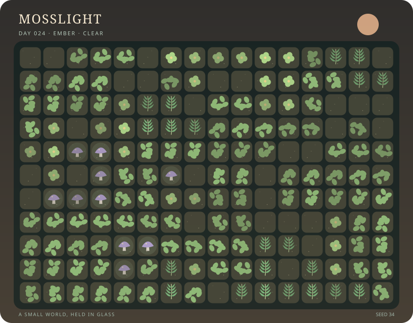

# Mosslight ✦

**A small world, held in glass.** Mosslight is an offline terrarium workbench: grow a living garden, shape its habitat, propagate plants, keep a field notebook, schedule care, and run reproducible experiments. Its SVG illustrations and survey maps are portable artwork; its JSON saves preserve the entire garden.



Python **3.9 or newer** is the only runtime dependency. The studio serves local assets on `127.0.0.1`, with no accounts, external services, or model calls.

## Start the studio

```sh
python3 -B -m mosslight serve --file my-garden.json --open
```

Visit <http://127.0.0.1:8765/> if the browser does not open. `--file` autosaves successful edits and creates the file when missing. Without it, export the garden before stopping the server. `--port 9000` selects another port.

The studio includes:

- **Living illustration and maps:** select tiles by mouse or keyboard; switch among art, moisture, nutrients, shade, vitality, terrain, mulch, and stress. Undo and redo the last 30 edits in the current server session.
- **Landscape workbench:** shape soil, sand, peat, ponds and stones; add shade cloth, rain barrels, bee houses and logs; tend areas with diamond, square or circular brushes.
- **Harvest and propagation:** harvest fiber, nectar and spores; craft compost, mulch and tonic; store seeds or grow seedlings and cuttings on the propagation bench.
- **Notebook:** tagged observations with optional tile locations, dated tasks, and a specimen cabinet that preserves plant measurements.
- **Care plans:** name garden beds, schedule finite repeating actions, and set conditional daily care rules.
- **Field station:** census, connected plant patches, habitat alerts, planting recommendations, time-series charts, calendar, almanac, forecasts and a shade-cloth experiment.
- **Command desk:** every mutation has a documented JSON command for workflows beyond the dedicated controls.

Coordinates in JSON, CSV and CLI commands start at **zero**. Tile labels in the illustration start at **one**. A radius-zero brush selects one tile.

## CLI workflows

```sh
python3 -B -m mosslight new garden.json --seed 34 --width 16 --height 11
python3 -B -m mosslight command garden.json '{"op":"terrain","args":{"x":2,"y":3,"terrain":"pond"}}'
python3 -B -m mosslight command garden.json '{"op":"note","args":{"content":"Rain gathers in the hollow","labels":["pond"]}}'
python3 -B -m mosslight grow garden.json --days 12
python3 -B -m mosslight inspect garden.json
python3 -B -m mosslight report garden.json
python3 -B -m mosslight render garden.json -o garden.svg
python3 -B -m mosslight render garden.json --layer moisture -o moisture.svg
python3 -B -m mosslight export garden.json csv -o survey.csv
python3 -B -m mosslight export garden.json markdown -o notebook.md
python3 -B -m mosslight export garden.json history --metric occupied -o history.svg
```

Explore futures without changing the source:

```sh
python3 -B -m mosslight forecast garden.json --days 24 --every 6 -o future.json
python3 -B -m mosslight compare garden.json future.json
python3 -B -m mosslight recommend garden.json glowcap --limit 5
python3 -B -m mosslight almanac garden.json --days 12
python3 -B -m mosslight almanac garden.json --calendar
python3 -B -m mosslight experiment garden.json examples/treatments.json --days 12 --every 3
```

Save and replay designs:

```sh
python3 -B -m mosslight new hollow.json --seed 34
python3 -B -m mosslight replay hollow.json examples/hollow-actions.json
python3 -B -m mosslight blueprint hollow.json --rect 0 0 3 2 --turns 1 -o hollow-pattern.json
python3 -B -m mosslight guide
```

`guide` prints species traits, recipes, and the required and optional arguments for all 34 mutation commands. A command is `{"op":"name","args":{...}}`. `replay` consumes a JSON array of commands and commits only if every command succeeds. `--output` saves a replay to a different garden. See [COMMANDS.md](COMMANDS.md) for copyable recipes and [the feature guides](BEHAVIORS.md) for growing, workbench, field station and sharing workflows.

Install the optional shell entry point with `python3 -m pip install .`, then use `mosslight` in place of `python3 -B -m mosslight`.

## Saves and reproducibility

Version 1 gardens, including `examples/first-garden.json`, migrate automatically to version 2 with ordinary soil, no structures, empty inventories and an empty notebook. Saving writes version 2. The original seed, cells, age, day and journal survive migration. No format conversion service is involved.

The same save and ordered commands reproduce the same future. Forecasts and experiments preserve their starting gardens. Successful edits can be saved and reopened; failed edits leave the previous garden available.

## Test and inspect

```sh
python3 -B -m unittest discover -s tests -v
node --check mosslight/static/app.js
node tests/test_studio.js
```

The Python suite exercises garden workflows and the local interfaces. HTTP tests use ephemeral loopback ports. Node 18 or newer is optional for browser checks. Add regression coverage when changing behavior.

## Project map

| Module | Responsibility |
| --- | --- |
| `model`, `state`, `validation` | Garden saves and validation |
| `engine`, `habitat`, `weather` | Seeded ecology, terrain, structures, wildlife, almanac |
| `gardening`, `nursery`, `catalog` | Garden tools, materials, seeds, propagation, field guide |
| `notebook`, `planning` | Notes, specimens, tasks, beds, plans, care rules |
| `analysis`, `experiments` | Census, spatial surveys, forecasts, controlled treatments |
| `exchange` | CSV, Markdown, planting blueprints, replay |
| `render`, `charts` | Artwork, maps, history SVG |
| `commands`, `server`, `__main__` | Commands, local HTTP API and CLI |
| `static` | Browser studio |

## Practical limits

This is a deliberately invented ecology, not a model for real horticulture. Grids are 4–40 tiles wide and 4–30 high. Each notebook/planning/propagation collection holds at most 500 entries; the journal retains 100 events and history retains 240 days. Plans contain at most 1,000 runs, experiments at most eight treatments over 120 days, and forecasts at most 365 days. The full save day limit is 1,000,000.

The server is designed for one person. Revisions help multiple browser tabs avoid stale writes, but separate server or CLI processes must not write the same file concurrently. Undo history belongs to the running server and is not included in exported saves. Blueprints store a design, not soil measurements or plant age. Longer simulations on maximum-size gardens or several experiments run synchronously and can briefly pause the interface. The command desk exposes advanced operations such as transplanting and blueprint/CSV import without dedicated forms.

MIT. See [LICENSE](LICENSE).

## Field courier

Carry notebook observations between disconnected devices with the optional
[Field courier](COURIER.md). Packets retain concurrent edits for review and can
share selected observations without replacing the rest of a notebook.

## Durable experiments

Run, resume and compare recorded ecological releases in a local campaign
workspace. Historical forks, immutable reports and provenance survive restarts.
See [Durable campaigns](CAMPAIGNS.md) for the commands and release contracts.

## Garden histories

Keep original branches while correcting earlier care or observations with
[Garden histories](HISTORY.md). Earlier objects remain recognizable across
replay, and conflicting edits remain available for review. The local history
CLI also supports forks, selected events, three-way rebase and garden export.

## Incremental experiment ensembles

Reuse unchanged calculations across experiment branches and retain result provenance.
See [Ensemble workflows](ENSEMBLES.md) for commands and consistency rules.

## Raw-save reconciliation

Reconcile disconnected raw-save edits with an explicit common ancestor, replica identities and reviewable conflict receipts.
See [Raw-save reconciliation](SAVE_MERGE.md) for workflows and contracts.

## Offline history exchange

Carry authored histories between disconnected installations and reconcile concurrent corrections while preserving their origins.
See [Offline history exchange](HISTORY_EXCHANGE.md) for workflows and contracts.

## Staged treatment studies

Screen treatments across saved garden cohorts with saved progress, comparable results and reusable care plans.
See [Staged treatment studies](STUDIES.md) for workflows and contracts.
